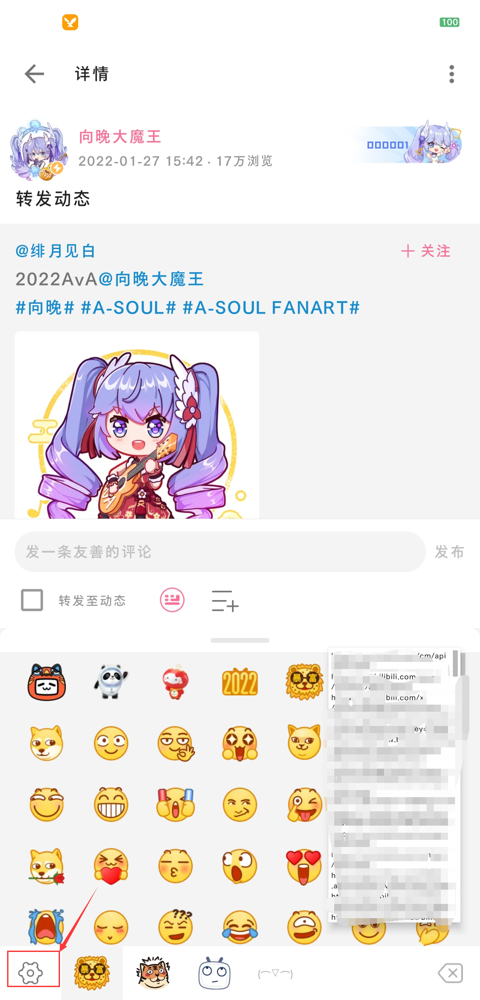
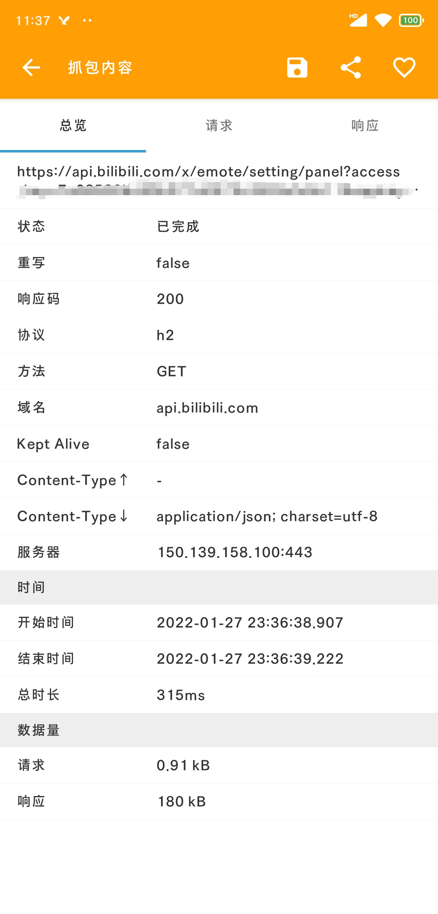
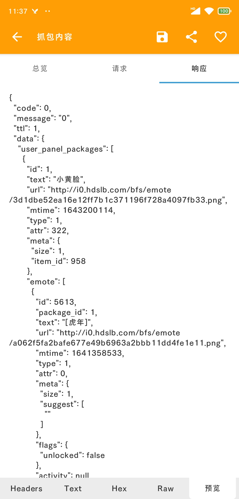

## 介绍

本项目通过使用 http canary 抓取安卓客户端请求的方式获取了哔哩哔哩当前（2022/1/27）的全部表情包列表，详情见 [stickers.json](https://github.com/amtoaer/bilibili-stickers/blob/main/stickers.json)。

基于此，我编写了一个简单程序遍历下载所有表情包，存储在了项目的 stickers 目录中。

> 为方便使用，特将表情包压缩后上传至[蓝奏云](https://wwi.lanzout.com/b0118hysf)，提取码**7st1**。

## json 文件结构

我们只需关注表情包的组织即可，可以轻松辨别：

1. `json["data"]["all_packages"]`内存储了全部表情包数据。
2. 每个表情包数据的 text 字段表示表情包名称， emote 字段存储了该表情包的单个表情。
3. 单个表情的 text 字段表示表情名称，url 字段表示表情链接，gif_url 字段表示该表情的动态版本链接。

## main.go 程序

该项目内的 Go 程序通过使用上述 json 条目支持了几个简单功能。

1. `go run main.go list` ： 查看表情包列表
2. `go run main.go [int]`： 下载指定表情包
3. `go run main.go all`： 下载全部表情包

当然，由于表情包已经存储在了仓库的 stickers 目录，使用者并不需要在意该程序，直接下载表情使用即可。

## 抓取方式

以下简要介绍一下该 json 文件的抓取方式。

1. 使用 http canary 抓取安卓客户端，启动后点开任意一条动态，展开表情，点击左下角设置：
   
2. 等待表情列表加载完成：
   
3. 打开 http canary，找到形如 **/x/emote/setting/panel** 的链接：
   
4. 查看请求响应，将响应保存：
   
